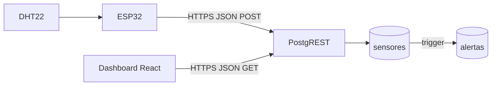

# Arquitectura del sistema IoT (ESP32 → Supabase → React)

Este documento resume el flujo técnico, la organización del código y el encaje con modelos de servicio en la nube.

## Flujo extremo a extremo

1. **Adquisición**: la ESP32 muestrea el DHT22 cada 5 segundos (GPIO23, alimentación 3.3 V).
2. **Transporte**: el microcontrolador abre una sesión TLS (`WiFiClientSecure`) y envía un `HTTP POST` a la API REST de Supabase (**PostgREST**), ruta `/rest/v1/sensores`, cuerpo JSON `{ temperatura, humedad }`.
3. **Persistencia**: Postgres inserta la fila; `fecha` se completa con `now()` en el servidor.
4. **Alertas (servidor)**: un trigger `AFTER INSERT` en `sensores` evalúa umbrales (temperatura > 45 °C, humedad > 80 %) y escribe en `alertas` con **cooldown de 10 minutos por `tipo_alerta`** para evitar spam. La función es `SECURITY DEFINER` y fija `search_path = public`.
5. **Políticas**: Row Level Security (RLS) permite `INSERT` y `SELECT` en `sensores`, y `SELECT`/`INSERT` en `alertas` al rol `anon` (la clave pública se usa en firmware y dashboard).
6. **Visualización**: el dashboard consulta periódicamente sensores y alertas vía PostgREST y renderiza tarjetas, gráfico (Recharts) y el panel **Alertas recientes**.

## Capas en el frontend (`dashboard/src`)

| Capa | Rol | Archivos representativos |
| --- | --- | --- |
| **Datos** | URLs, cabeceras `apikey` / `Authorization`, parsing de respuestas | `data/env.ts`, `data/sensoresRepository.ts`, `data/alertasRepository.ts` |
| **Lógica** | Polling compartido (`POLL_MS`), sensores, alertas | `logic/pollMs.ts`, `logic/useSensoresDashboard.ts`, `logic/useAlertasFeed.ts` |
| **Presentación** | UI glass, gráfico, panel de alertas | `presentation/components/*`, `presentation/pages/DashboardPage.tsx`, `presentation/utils/temperatureColor.ts` |

Esta separación mantiene la vista libre de detalles HTTP y facilita pruebas o sustituir PostgREST por otro backend.

## APIs utilizadas

- **PostgREST** (expuesta por Supabase en `/rest/v1`): contrato HTTP sobre tablas Postgres. La ESP32 y el navegador son clientes REST.
- **RLS de Postgres**: políticas declarativas que filtran permisos por rol (`anon`), sin lógica en el dispositivo más allá de poseer la clave adecuada.

> La **anon key** es pública por diseño en apps cliente. Cualquiera con la URL y la clave puede insertar/leer según RLS. Para producción industrial se recomienda **Edge Function** con un token de dispositivo, **Supabase Vault**, o un broker MQTT con autenticación fuerte.

## IaaS, PaaS y SaaS (lectura práctica)

- **IaaS (Infraestructura como servicio)**: hipervisor, red y almacenamiento administrados por el proveedor; usted gestiona SO y runtime. Ej.: VMs en la nube donde instalaría Postgres y PostgREST manualmente.
- **PaaS (Plataforma como servicio)**: Postgres administrado, backups, escalado de base, APIs listas. **Supabase** encaja aquí: usted define esquema y políticas; la plataforma opera la base y la API.
- **SaaS (Software como servicio)**: aplicación completa lista para usar. Si usara un panel comercial cerrado sin código propio, sería SaaS puro. En su caso, **Vercel** como hospedaje del build de Vite se acerca a SaaS/PaaS de entrega estática + CDN.

En conjunto: **ESP32 (edge)** + **Supabase (PaaS datos/API)** + **Vercel (hosting frontend)**.

## Despliegue en Vercel (resumen)

1. Suba el repositorio a GitHub/GitLab/Bitbucket.
2. En Vercel: *New Project* → importe el repo.
3. **Root Directory**: `dashboard` (este monorepo pequeño).
4. **Framework Preset**: Vite.
5. **Environment Variables**: `VITE_SUPABASE_URL`, `VITE_SUPABASE_ANON_KEY` (mismos valores que en `.env` local).
6. Despliegue: `npm run build` / salida `dist` la detecta Vercel automáticamente.

Tras el deploy, abra la URL de Vercel; el cliente solo necesita HTTPS y las variables `VITE_*` compiladas en el bundle.

## SQL y firmware

- Migración versionada: `supabase/migrations/001_sensores.sql` (tabla + índice + RLS + grants).
- Firmware: `firmware/esp32_dht_supabase/` con `secrets.h` local (no versionado) creado desde `secrets.example.h`.
